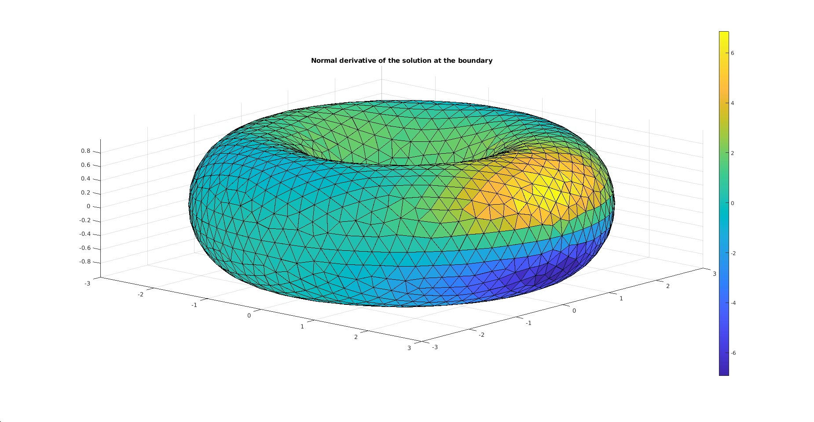
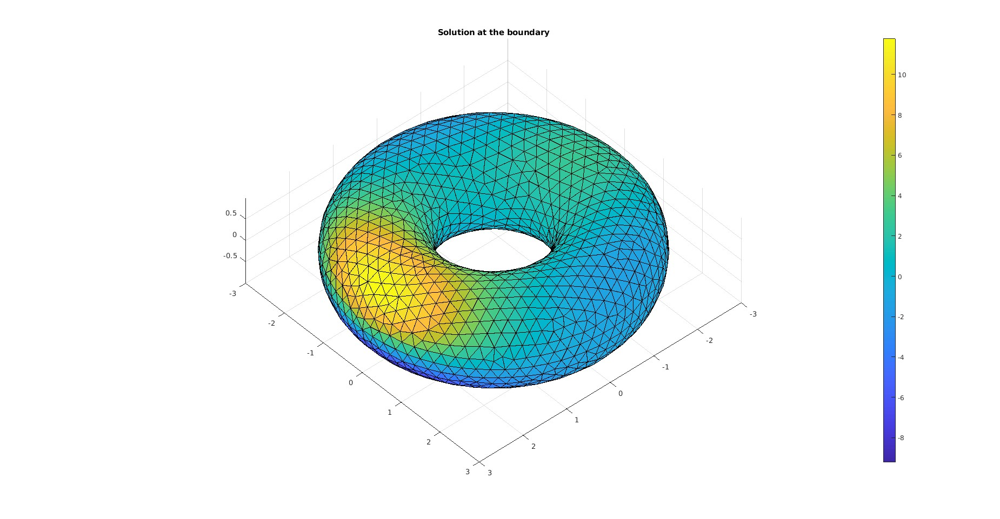
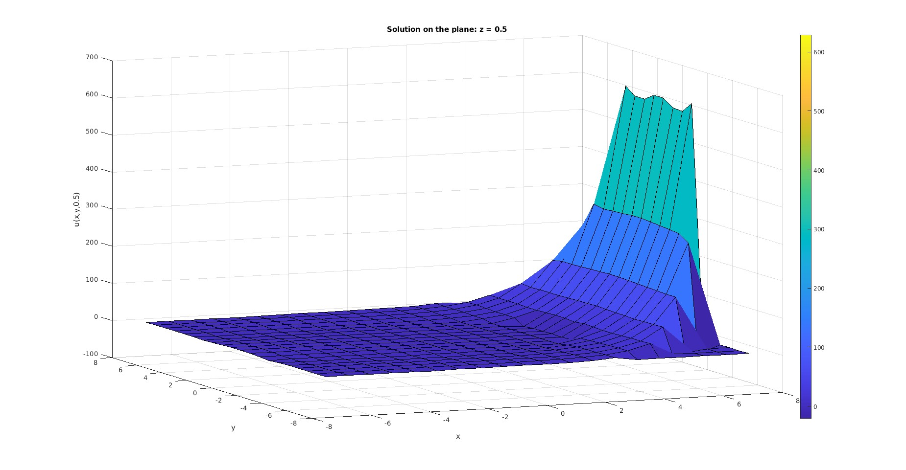

# Boundary-Element-Method-3D
This repository contains a MATLAB implementation of the Boundary Element Method (BEM) designed to solve the Laplace equation on generic 2D meshes. It supports constant, linear and quadratic elements for boundary discretization, allowing flexibility in computational complexity. The implementation is structured to ensure clarity and modularity, making it easy to understand, use, and extend for various applications. Currently, the code supports two kinds of meshes. For linear and constant elements a simple .stl surface mesh file has to be provided. Instead, for quadratic elements a .mat file has to be produced and provided as input. The reason for this resides in MATLAB completely lacking a second-order-surface mesh reader. A simple jupiter notebook has been created to simply manage such inconvenience where a .msh file can be converted into a .mat file. Clearly any conversion to *.mat file is in principle possible. SInce .gmsh API is needed, createing a conda-env is advisable.

A simple example of a result provided by the code. Test case 3 (cfr. /results fd) is shown here below:

*Figure 1: normal derivative of u (solution) toroidal surf. R = 2.*

*Figure 2: assigned Dirichlet condition toroidal surf. R = 2.*

*Figure 3: inside domain implementation (not fully implemented for non-connected surfaces) toroidal surf. R = 6.*

Another example: test case 2 solving an oscillating problem with mixed bc's on a cubic domain with quadratic elements.

*Figure 4: normal derivative of u (solution).*

*Figure 5: u (solution).*
